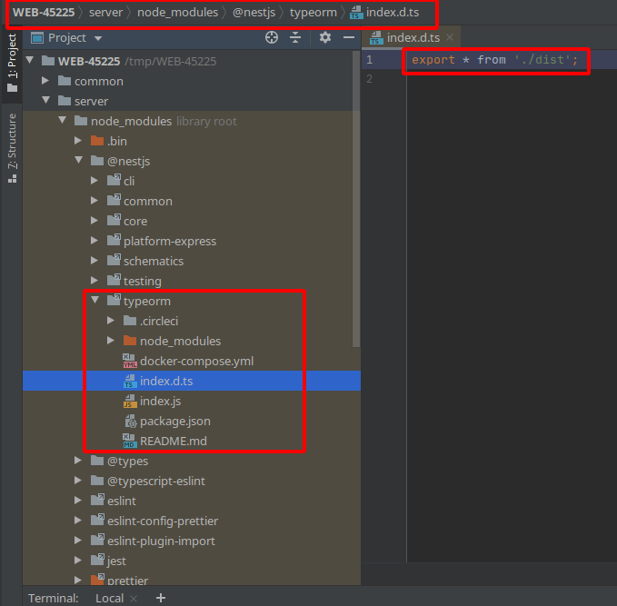

## Repro Steps

### Clone and install
```console
git clone git@github.com:btilford/WEB-45225.git
cd WEB-45225
npx @microsoft/rush update
webstorm .
```


### Verify @nestjs/typeorm/dist directory exists
```console
ls -l server/node_modules/@nestjs/typeorm/ | grep dist
```

### From the IDE @nestjs/typeorm/dist is hidden.




### From scratch


1. Generate project
    ```console
    npm install -g @microsoft/rush @nestjs/cli
    mkdir repro
    cd repro
    rush init
    nest new
    ```
2. Add the nest app to rush.json projects array
    ```json5
    {
      "shouldPublish": false,
      "packageName": "nest-app",
      "projectFolder": "nest-app"
    }
    ```
3. Add a project that publishes it's dist directory like @nestjs/typeorm
    ```console
    rush update
    rush add -p @nestjs/typeorm
    ```


